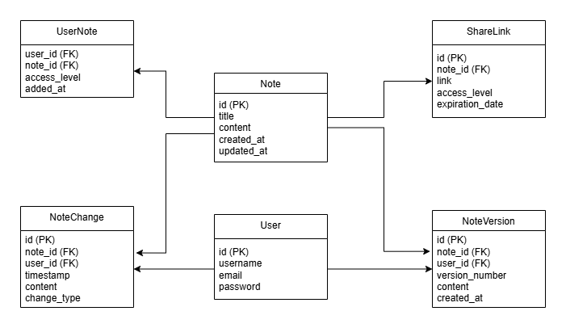

# CollaborativeNotes

CollaborativeNotes is a cloud-based application similar to Notion or Google Docs, aimed at allowing multiple users to simultaneously edit a shared text file. This application is designed to be simple and focuses solely on text editing without implementing support for images or other complex formatting. The application uses a Spring Boot backend with MariaDB as the database, and the front end is being developed separately using Angular.

## Features

- **Simultaneous Editing**: Multiple users can edit a single note at the same time using WebSockets for real-time updates.
- **Text Only**: Focuses on text-based editing with no image or advanced formatting support.
- **Access Levels**: Notes can be shared with different access levels for users (editor/viewer).
- **Share via Links**: Notes can be shared using unique links that provide specific permissions.
- **Version Control**: A version control mechanism is implemented for tracking changes and maintaining a history of edits.

## Tech Stack

- **Backend**: Spring Boot
- **Database**: MariaDB
- **Frontend**: Angular
- **Real-time Collaboration**: WebSockets

## Project Structure

The backend code is structured as follows:

- `configs`: Contains configuration classes, such as `WebSocketConfig` and `DatabaseSeederConfig`.
- `controllers`: REST controllers that expose endpoints for interacting with the application.
- `database`:
    - `entities`: JPA entity classes representing the database structure (`Note`, `User`, etc.).
    - `repositories`: Interfaces extending `JpaRepository` for data access operations.
    - `seeders`: Classes to seed the database with initial data (`NoteSeeder`, `UserSeeder`, etc.).
- `models`: Classes representing data models used for WebSocket communication (`NoteEditMessage`).
- `CollaborativeNotesApplication`: The main entry point of the Spring Boot application.

## Setting Up the Project

### Prerequisites

- **Java 17** or higher
- **Maven**
- **MariaDB**: Ensure MariaDB is running locally or update the `application.properties` file for a remote connection.

### Steps to Run

1. **Clone the Repository**:
   ```sh
   git clone https://github.com/lurio84/CloudComputingProject
   ```
2. **Navigate to Project Directory**:
   ```sh
   cd CloudComputingProject
   ```
3. **Set Up Database**:
    - Create a MariaDB database named `collaborative_notes`.
    - Update the connection details in `src/main/resources/application.properties`.
4. **Run the Application**:
   ```sh
   mvn spring-boot:run
   ```

### Configuration

The application uses the following configuration properties in `application.properties`. Additionally, you need to set up a `.env` file at the root of the project with the basic parameters required for database connection (`DATABASE_URL`, `DATABASE_USERNAME`, `DATABASE_PASSWORD`).

- **JPA Configuration**:
  ```properties
  spring.jpa.hibernate.ddl-auto=create-drop
  spring.datasource.initialization-mode=always
  ```
  These settings ensure that the database schema is created at startup.

### Environment Variables

A `.env.example` file is included in the repository. You should copy this file to `.env` and set your local configuration:

```sh
cp .env.example .env
```

Update the `.env` file with your specific database connection details.

## Database Relational Model

The following diagram shows the relational model of the database used in CollaborativeNotes:



## Contributing

Contributions are welcome! If you'd like to contribute to the project, please fork the repository and create a pull request. Make sure to follow best practices and add meaningful comments to your code.

## License

This project is licensed under the MIT License.

