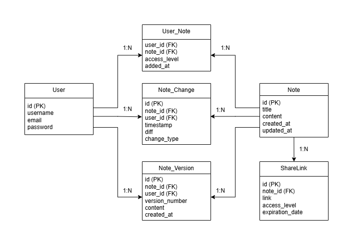

# CollaborativeNotes

CollaborativeNotes is a cloud-based application similar to Notion or Google Docs, aimed at allowing multiple users to simultaneously edit a shared text file. This application is designed to be simple and focuses solely on text editing without implementing support for images or other complex formatting. The application uses a Spring Boot backend with MariaDB as the database, and the front end is being developed separately using Angular.

## Features

- **Simultaneous Editing**: Multiple users can edit a single note at the same time using WebSockets for real-time updates.
- **Text Only**: Focuses on text-based editing with no image or advanced formatting support.
- **Access Levels**: Notes can be shared with different access levels for users (editor/viewer).
- **Share via Links**: Notes can be shared using unique links that provide specific permissions.
- **Version Control**: A version control mechanism is implemented for tracking changes and maintaining a history of edits.

## Tech Stack

- **Backend**: Spring Boot
- **Database**: MariaDB
- **Frontend**: Angular
- **Real-time Collaboration**: WebSockets

## Project Structure

The backend code is structured as follows:

- `configs`: Contains configuration classes, such as `WebSocketConfig` and `DatabaseSeederConfig`.
- `controllers`: REST controllers that expose endpoints for interacting with the application.
- `database`:
    - `entities`: JPA entity classes representing the database structure (`Note`, `User`, etc.).
    - `repositories`: Interfaces extending `JpaRepository` for data access operations.
    - `seeders`: Classes to seed the database with initial data (`NoteSeeder`, `UserSeeder`, etc.).
- `models`: Classes representing data models used for WebSocket communication (`DiffRequest`).
- `CollaborativeNotesApplication`: The main entry point of the Spring Boot application.

## Setting Up the Project

### Prerequisites

- **Java 17** or higher
- **Maven**
- **MariaDB**: Ensure MariaDB is running locally or update the `application.properties` file for a remote connection.

### Steps to Run

1. **Clone the Repository**:
   ```sh
   git clone https://github.com/lurio84/CloudComputingProject
   ```
2. **Navigate to Project Directory**:
   ```sh
   cd CloudComputingProject
   ```
3. **Set Up Database**:
    - Create a MariaDB database named `collaborative_notes`.
    - Update the connection details in `src/main/resources/application.properties`.
4. **Run the Application**:
   ```sh
   mvn spring-boot:run
   ```

### Configuration

The application uses the following configuration properties in `application.properties`. Additionally, you need to set up a `.env` file at the root of the project with the basic parameters required for database connection (`DATABASE_URL`, `DATABASE_USERNAME`, `DATABASE_PASSWORD`).

- **JPA Configuration**:
  ```properties
  spring.jpa.hibernate.ddl-auto=create-drop
  spring.datasource.initialization-mode=always
  ```
  These settings ensure that the database schema is created at startup.

### Environment Variables

A `.env.example` file is included in the repository. You should copy this file to `.env` and set your local configuration:

```sh
cp .env.example .env
```

Update the `.env` file with your specific database connection details.

## Database Relational Model

The following diagram shows the relational model of the database used in CollaborativeNotes:



---

## Database Explanation

### **User Entity**
The `User` entity stores user information such as usernames, emails, and authentication data.

**Attributes of the User Entity:**
1. **id**: Primary key (unique identifier for each user).
2. **username**: The user's name or nickname.
3. **email**: Contact email of the user.
4. **password**: Encrypted password for authentication.

---

### **Note Entity**
The `Note` entity represents the notes or documents being worked on, including their content, titles, and timestamps.

**Attributes of the Note Entity:**
1. **id**: Primary key (unique identifier for each note).
2. **title**: Title of the note.
3. **content**: Content of the note.
4. **created_at**: Timestamp of when the note was created.
5. **updated_at**: Timestamp of the last modification.

---

### **User_Note Table**
The `User_Note` table defines access levels for users collaborating on a note.

**Attributes of the User_Note Table:**
1. **user_id**: Foreign key linking to the `User` table.
2. **note_id**: Foreign key linking to the `Note` table.
3. **access_level**: Specifies the user's access permissions (e.g., read, write, admin).
4. **added_at**: Timestamp of when the user was added to collaborate on the note.

---

### **Note_Change Table**
The `Note_Change` table records all modifications for audit and rollback purposes.

**Attributes of the Note_Change Table:**
1. **id**: Primary key (unique identifier for the change).
2. **note_id**: Foreign key linking to the `Note` being changed.
3. **user_id**: Foreign key linking to the `User` who made the change.
4. **timestamp**: When the change was made.
5. **diff**: Details of the change (e.g., what was added/removed).
6. **change_type**: Type of change (e.g., "edit", "delete").

---

### **Note_Version Table**
The `Note_Version` table allows us to store and manage multiple versions of notes.

**Attributes of the Note_Version Table:**
1. **id**: Primary key (unique identifier for the version).
2. **note_id**: Foreign key linking to the `Note`.
3. **user_id**: Foreign key linking to the `User` who created the version.
4. **version_number**: Number representing the version order.
5. **content**: Content of the version.
6. **created_at**: Timestamp when the version was created.

---

### **ShareLink Table**
The `ShareLink` table facilitates the sharing of notes via links with specific permissions and expiration dates.

**Attributes of the ShareLink Table:**
1. **id**: Primary key (unique identifier for the shared link).
2. **note_id**: Foreign key linking to the `Note`.
3. **link**: The unique URL for sharing.
4. **access_level**: Permissions for the shared link (e.g., read-only).
5. **expiration_date**: Expiry date of the shared link.

---

### **Differences Between Note_Change and Note_Version Tables**
The main difference between `Note_Change` and `Note_Version` is:

- **`Note_Change`**: Stores **individual changes**, which are small, incremental edits, ideal for real-time collaboration and change tracking.
- **`Note_Version`**: Stores **entire document versions**, representing the complete state of the document at a specific point in time, which is crucial for version control and recovery.

- **Purpose**:
  - The `Note_Change` table is essential for **real-time collaboration**.

## Contributing

Contributions are welcome! If you'd like to contribute to the project, please fork the repository and create a pull request. Make sure to follow best practices and add meaningful comments to your code.

## License

This project is licensed under the MIT License.

